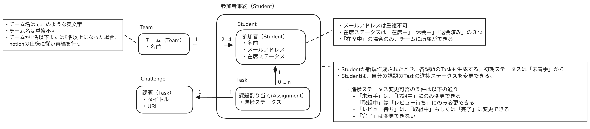

## ドメインモデル

`.docs/ドメインモデル.excalidraw`にExcalidrawからのエクスポートファイルを保存している

## ユースケース

### Student

- 自分のtaskを着手中、レビュー待ち、完了に変更する

### 管理者

- challengeを作成、編集する
- teamを作成する
- studentをteamから脱退させる
- studentをteamに加入させる
- studentを作成する
- studentを在籍、休会、退会、卒業にする
- studentに新しいtaskを付与する
- studentのtaskを削除する